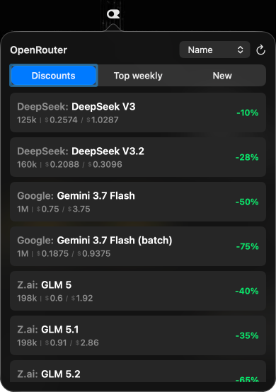

# OpenRouter Widget for macOS

Browse OpenRouter models, compare prices, and copy ready-to-use model IDs without leaving the menu bar.

 

## What it does

OpenRouter Widget is a native, lightweight macOS menu-bar app for quickly exploring the OpenRouter catalog.

- **Three focused views:** Discounts, Top weekly, and New.
- **Useful sorting:** sort each tab by the criteria that matter there, including name, price, discount, rating, or release date.
- **Prices at a glance:** see context size and input/output token prices in a compact card.
- **One-click model IDs:** click anywhere on a model card to copy an identifier such as `openrouter/z-ai/glm-5.3-flash`.
- **Resilient data:** the widget keeps the last known good list when a source temporarily fails.
- **Built-in updates:** new releases are detected automatically and installed from GitHub.

The app lives entirely in the menu bar and does not add an icon to the Dock.

## Download and install

1. [Download the latest `OpenRouterWidget.app.zip`](https://github.com/AlexProUX/or_widget/releases/latest/download/OpenRouterWidget.app.zip).
2. Double-click the archive to extract `OpenRouterWidget.app`.
3. Move the app to the **Applications** folder.
4. On first launch, Control-click the app and choose **Open**.
5. If macOS still blocks it, open **System Settings → Privacy & Security**, choose **Open Anyway**, and confirm.

### Requirements

- macOS 13 or later
- Apple silicon Mac

## Using the widget

- **Left-click** the OpenRouter menu-bar icon to open or close the widget.
- Choose **Discounts**, **Top weekly**, or **New**, then use the sort menu to reorder the current list.
- Click any model card to copy its ready-to-paste OpenRouter identifier.
- **Right-click** the menu-bar icon to see the installed version, install an available update, or quit.
- Use the refresh button to request fresh model data at any time.

## Updates

The widget checks GitHub Releases at launch and every three hours. When a newer version is available, an orange **Update** button appears in the widget and an **Update** action appears in the right-click menu.

You can also browse or download every published build from the [Releases page](https://github.com/AlexProUX/or_widget/releases).

## Version history

| Version | Highlights |
| --- | --- |
| [0.1.2](https://github.com/AlexProUX/or_widget/releases/tag/v0.1.2) | Removed focus-ring artifacts across the widget and refined the Update control. |
| [0.1.1](https://github.com/AlexProUX/or_widget/releases/tag/v0.1.1) | Initial focus-state hotfix for the tab control. |
| 0.1.0 | Initial packaged preview with model tabs, sorting, clipboard copy, caching, and in-app updates. |

## Notes

Model availability, prices, context sizes, discounts, and rankings come from OpenRouter and may change over time. OpenRouter Widget is an independent companion app and is not affiliated with OpenRouter.
